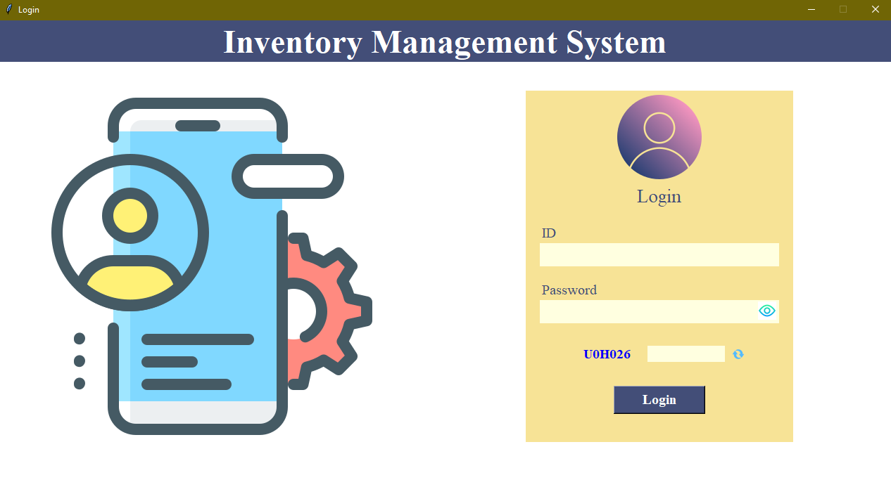
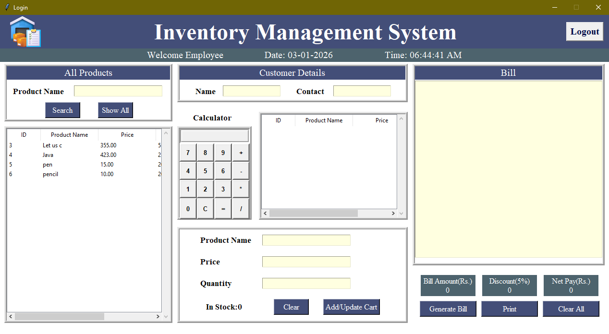
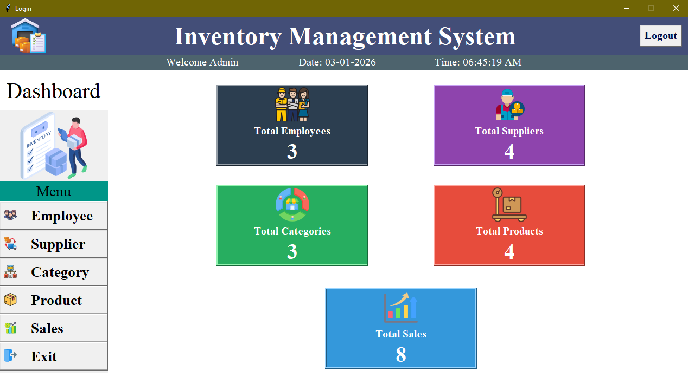

# Inventory Management System 🧾📦

A desktop Inventory Management System built with **Python**, **Tkinter**, and **MySQL**.  
This README includes inline screenshots (actual images).

---

## Overview
A user-friendly Inventory Management System with GUI for managing products, suppliers, employees and sales. It supports login (Admin / Employee), product search, cart & billing, and an admin dashboard showing totals and basic stats.

---

## Features ✨
- Secure login system with captcha (Admin & Employee) 🔐  
- Product list, search, add/update/delete products 🔎  
- Supplier & Employee management 🧑‍🤝‍🧑  
- Add to cart, generate printable bills, apply discounts 🧾🖨️  
- Calculator inside billing screen ➕➖✖️➗  
- Admin dashboard with totals (Employees, Suppliers, Categories, Products, Sales) 📊

---

## Tech Stack 🧰
- Language: Python 3.8+ 🐍  
- GUI: Tkinter (standard Python) 🪟  
- Database: MySQL (or MariaDB) 🗄️  
- Additional Python libraries: see `requirements.txt` (e.g., mysql-connector-python / PyMySQL, Pillow for images, reportlab or fpdf for PDF printing)

---

## Screenshots 🖼️

Login Screen  

Billing Screen  

Admin Dashboard  

---

## Contact ✉️
Created by Trapti Singh  
